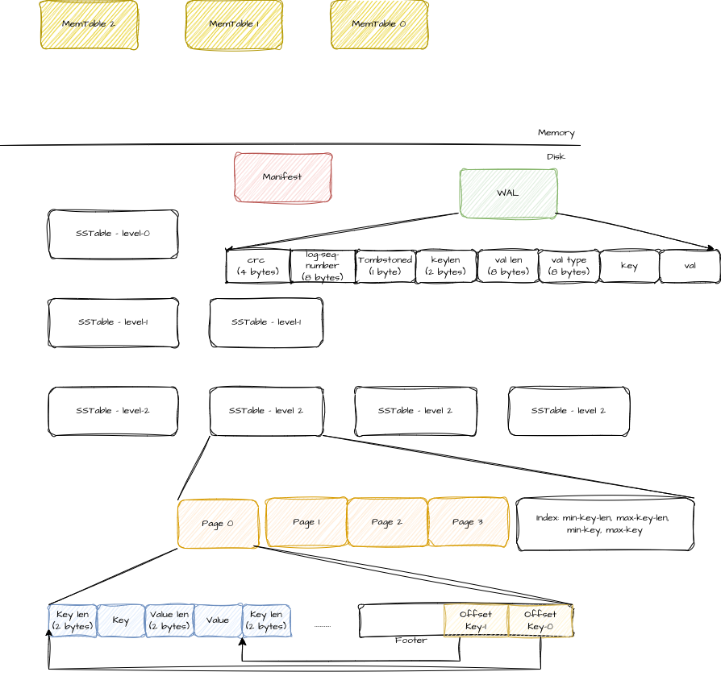

# A Toy LSM database

Goal: To implement an LSM tree based database with the following APIs.
- put(key, value) -> Result<(), Error>
- get(key) -> Option<&Value>
- del(key) -> Result<(), Error>

The LSM tree (Log-Structured Merge-tree) is a data structure optimized for
write-heavy workloads by ensuring all writes are written sequentially to disk.

Data resides in two locations:
1. **MemTable (Memory Table)**: An in-memory buffer where writes accumulate
        until they are flushed to sstables. For durability, they are backed by a
        Write-ahead-log between the memtable write and flush to disk.
2. **SSTable (Sorted String Table)**: Immutable, sorted files on disk organized into levels.

## Guarantees
1. Durability: Once a write (put or del) is accepted, it will always be available. Data is fsynced
    into the WAL before being written to the memtable.
1. Linearizability: Writes are applied in the order of their arrival (ticket
    order. more on this later).
1. Safety: The database is designed to be safe by construction by using the strengths of Rust's type system.
    I achieve this using linear types and state machines.
1. Snapshot Isolation: Readers view a consistent immutable state of the world. The snapshot is
    taken from when the read was admitted into the system.

## Properties
1. The database uses only one background thread for compaction. Reads are writes are handled
    within the Application threads that make these requests. This makes performance characteristics
    predictable.
1. All writes are versioned. The database is a collection of all data objects
    where write to any (using foreground writes or background compaction)
    advances the global database version. This ensures no writes step on each other.
1. The manifest is the source of truth. It is the on-disk representation of all all files
    that make up the database.
1. Although the system does not handle recovery from data corruption by keeping multiple copies
    of data, it does use checksum to detect corrupt or partially written files.
1. Any crash puts the database back into the last consistent state on which the latest WAL is
    applied at bootstraping to recover the database to the last known valid state.
1. Concurrency: The database handles writes and reads from multiple threads.

**Write Path**: Data is written to the **WAL** (Write-Ahead Log) for durability
and then inserted into the **MemTable**.
**Read Path**: Reads check the **MemTable** first. If not found, the search
continues through the **SSTables** on disk, starting from Level 0 down to the
deepest level.

## Architecture


_Credit:_ https://skyzh.github.io/mini-lsm/00-overview.html
Credit for  the WAL format: https://adambcomer.com/blog/simple-database/wal/

### Data Stores

1. Memtable
    In-memory structure (SkipList) for fast access. There can be multiple memtables, but only one is mutable; others are immutable (frozen) waiting to be flushed.
2. WAL (Write-Ahead Log)
    Append-only file on disk ensuring durability of the Memtable.
3. SSTable
    Stores sorted key-value pairs on disk. Organized into 4KB Blocks, an Index Block, and a Bloom Filter Block.
4. Manifest
    The source of truth. Tracks the active SSTables, their levels, and the active WALs.

### Actors:
- Writer: Writes the data into the memtable and the WAL.
- Reader: Reads the data. Looks for the key in the memtables (newest to oldest). Then into sstables
    level 0 to N. For each ss-table:
    1. Checks if the key is within the file's min/max range (cached in memory).
    2. Checks the Bloom filter.
    3. If potentially present, loads the Index Block to find the specific Data Block.
    4. Reads the Data Block to find the key.
- Compactor: Background process that flushes frozen Memtables to L0 and merges SSTables between levels to maintain the LSM tree structure and reclaim space.

We use message passing heavily. Actors manage the state of the data stores and communicate via messages.

Let's talk about the state transitions:

1. Init: The database starts in this state. It reads the manifest to figure out where it left off,
and tries to get back to the last stable state. The DB also reads the WAL and constructs the Memtable
state.
2. RW: Read + write. The database is available for operations.
3. RWC: Read + write + Compaction. The database is serving requests while background compaction is running.


## Compaction

Compaction is done by a background thread. This is the gist of the steps it takes. Details after.

1. Flush the memtable to disk as a new L0 SSTable.
2. Update the Manifest to track the new L0 file.
3. Delete the WALs corresponding to the flushed Memtables.
4. Check compaction triggers recursively (L0 -> L1, L1 -> L2, etc.). Perform compaction if a trigger is met, update the Manifest, and then check the next level. Stop when a level's trigger is not met.
5. Go over all the files in the directory and delete the ones not referenced by the last
   two manifests.

### Memtable Flush: Creating the L0 sstable files

Memtable is flushed to disk when the total memory footprint of the database
exceeds the configured threshold. This needs to be fast to release memory quickly.

When a memtable flush is triggered, the compactor thread picks up all of
the frozen memtables and attempts to flush them to disk to create new L0 sstables, one new sstable
per frozen memtable.

Let's start with the invariants:
1. All memtables are sorted.
2. All sstables are sorted internally.
3. L0 sstables may have overlapping key ranges (because they are raw dumps of memtables).
4. L1 and deeper levels have NO overlapping key ranges between files within the same level.

The steps to flush the frozen memtables are as follows:
1. Iterate over the frozen memtable(s) using a standard iterator.
2. Write the key-value pairs sequentially to a new SSTable file on disk.
3. Once the file is written, update the Manifest to include this new file in Level 0.
4. Delete the WALs corresponding to the flushed memtables.

Note: We do NOT merge with existing L0 files during flush. This ensures the flush is fast
(sequential write).

### L0 to L1 Compaction.
_Trigger_: When the _number_ of files in L0 exceeds a threshold (e.g., 4).
_Candidate L0 files_: All of them because of overlapping keys.

1. Pick all files in L0.
2. Determine the key range covered by these L0 files (min_key to max_key).
3. Find all files in L1 that overlap with this range.
4. Perform a K-way merge-sort of all L0 files and the overlapping L1 files.
5. Write the result to new L1 SSTable file(s). We enforce a max SSTable size (e.g., 2MB). If the data exceeds this, we cut a new file. This results in multiple files in L1.
6. Update Manifest: Remove the old L0 files and the overlapping L1 files, and add the new L1 files.

##### Sort Order for keys
order(k1, k2):
    if k1 < k2: return k1
    elif k2 < k1: return k2
    else: # keys are equal. Higher seq no takes precedence.
        if k1.seq > k2.seq: return k1
        else: return k2

### Compaction: L1 -> L2
Trigger: When the _total size_ (sum of all file sizes) of L1 exceeds a threshold (e.g., 10MB).

1. Pick one file from L1 (usually the one with the oldest data or via round-robin).
2. Find all files in L2 that overlap with the key range of the chosen L1 file.
3. Merge-sort the L1 file and the overlapping L2 files.
4. Write the result to new L2 file(s). We enforce a max SSTable size (e.g., 2MB). If the data exceeds this, we cut a new file. This results in multiple files in L2.
5. Update Manifest: Remove the compacted L1 file and the old overlapping L2 files, and add the new L2 files.

### Compaction: L2 -> L3 (and deeper levels)
Trigger: Same as it is for L1 -> L2.

Compaction Strategy: Same as it is for L1 -> L2.

**Garbage Collection (Tombstones):**
When compacting to the bottom-most level (e.g., if L3 is the max level), we can permanently remove keys marked with tombstones, as we are guaranteed that no older version of the key exists in lower levels. This allows the database to reclaim space.

## Structures on Disk

### Manifest

Manifest contains a list of all information in the database. This includes the list of sstables and the WAL files. Anything the untouched by the manifest, is not required for the database anymore and can be deleted.

At any point there are two manifest files. The Nth and the N-1 th.
At the start, the database reads the versions of the manifest to determine the latest manifest and reads it into memory. New Manifests are written after compaction. This will create the third manifest, so as the last step of compaction, the oldest one will be deleted.
For some reason if the compaction failed and could not delete the oldest manifest, the next database startup will clear the oldest one.

#### The manifest structure:

##### Manifest Header
|Field|Size|Type|Description|
|---|---|---|---|
|magic_bytes|4 bytes| [u8; 4]|The text "ELSM"|
|checksum|4 bytes|u32|file integrity|
|file-size|4 bytes|u32|How many more bytes to read and checksum before moving forward|
|format-version|4 bytes| u32|If the format of the manifest changes we increment this. This change will cause the database to reject the old manifest file.|
|num_wals|4 bytes|u32|How many wal entries; how many memtables to generate|
|num levels|4 bytes|u32|How many levels of sstables we have currently|
|levels|variable|-|The payload: A sequence of num_levels `Level structures`|

The in-memory version of the manifest will contain the next-manifest-number. The
next manifest file will be named `next-manifest-number.mf`.

##### Level Structure
|Field|Size|Type|Description|
|---|---|---|---|
num_files|4 bytes|u32|How many files in this level|
files|variable|-|A sequence of num_files `FileMetadata` structures|

##### File Metadata
|Field|Size|Type|Description
|---|---|---|---|
|file_id|4 bytes|u32|Unique ID of the SSTable. Never recycled|
|file-size|4 bytes|u32|size of file on disk|
|min-key|variable|-|smallest key in `InternalKey` format|
|max-key|variable|-|largest key in `InternalKey` format |

##### Internal Key Format
|Field|Size|Type|Description|
|---|---|---|---|
|lsn|4 bytes|u64|The log entry that created this key|
|key-len|2 bytes|u16|length of smallest key|
|key|variable|-|key bytes|

### SStable
The full sstable is a few megabytes large. It is broken down
into several Blocks (typically 4KB).

#### File Layout
The file consists of a sequence of blocks:
1. **Data Blocks**: [Block 0, Block 1, ... Block N]
2. **Index Block**: Stores the start key and offset for every Data Block.
3. **Bloom Filter Block**: Optimization for non-existent keys.
4. **Footer**: Fixed size, contains offsets to the Index and Bloom Filter.

#### Footer
- offset to the start of the index block: 8 bytes
- offset to the start of the bloom filter block: 8 bytes
- checksum: 4 bytes (CRC32 of the offsets)
- magic number: 4 bytes

#### Data Block Format
Each Data Block contains a header and a list of entries. The block size is typically 4KB, but can be larger for large values.
- block-len: 4 bytes (u32) - Length of the remaining block (checksum + entries).
- checksum: 4 bytes (CRC32) - Checksum of the entries.
- entries:
  - key in `InternalKey` format. See above.
  - value in `Internal Value` format. See below.
... repeated until block is full.

##### Internal Value Format
|Field|Size|Type|Description|
|---|---|---|---|
|tombstoned|1 byte|u8|Whether this value is tombstoned|
|value-type|1 byte|u8|Value types supported|
|value-len|4 bytes|u32|how many of the next few bytes correspond to value|
|value|variable|-|value bytes|

##### Blocks with keys or values larger than the default block size
The 4KB block size is a "soft limit" or target size.
1. If a key-value pair fits in the remaining space of the current 4KB block, it is added.
2. If it does not fit:
   - The current block is finalized and written to disk.
   - A new block is started.
   - If the key-value pair is larger than 4KB itself, it is written to this new block, and the block is allowed to exceed the 4KB limit. It will take up as much space as needed (header + key + value).
   - The next key-value pair starts a new block.

#### Index Block Format
The entries of the index block store a list of keys in `Internal Key` format.

1. min-key for sstable in `InternalKey` format.
1. max-key for sstable in `InternalKey` format.
foreach data-block:
    - min-key for data-block in `InternalKey` format.
    - max-key for data-block in `InternalKey` format.
    - offset: 8 bytes (The offset in the file where that data block starts)

One can determine if the sstable is worth further investigation by
just scanning the first two sstable level min and max keys. If the range
includes the search key, one should read the block level min and max keys to
quickly land on the block of interest. Then the reader can page in the block
and go over the keys to find the search key if present.

#### Bloom Filter Block Format
The Bloom Filter Block follows the same structure as the Data Block (block-len, checksum, data). The data is the raw bitset of the filter.

### WALs
Every write request is persisted in the WAL first and then written to
the memtable. There are two kinds of writes:
- inserts
- deletes

Everything is an insert or put. Updates are inserts of an existing key with a new value. Deletes are
updates of an existing key with the tombstone set.

In the rest of the section, we will go over how to represent this.

### Write-Ahead Log (WAL)

The WAL is an append-only file that stores every write operation.

**Format**:
Each entry consists of:
1.  **CRC** (4 bytes): CRC32 checksum of the rest of the entry.
2.  **Key** (Variable): The serialized key.
    -   **LSN** (8 bytes)
    -   **Length** (2 bytes)
    -   **Bytes** (Variable)
3.  **Value** (Variable): The serialized value.
    -   **Metadata** (1 byte):
        -   Bit 0: Tombstone (1=True, 0=False).
        -   Bits 1..7: Type (0=Bytes, 1=String, 2=Int).
    -   **Length** (4 bytes)
    -   **Bytes** (Variable)

This format ensures that even partial writes can be detected (via CRC or truncated read) and ignored during recovery.

A WAL is written and read from start to finish. Therefore, we
do not need clever mechanisms like in sstable to compare and skip
ahead.

## Implementation Notes

The implementation leverages Rust's type system to ensure valid state transitions
and to make sure that only allowed actions are invoked for a state. 

The manifest is the representation of the cumulative state of the database.
In addition the database starts off in ReadOnly mode. We make sure that
no writes go through while the system is reading and building its memtable from WAL
and reading the minimal SS table state into memory. This phased is designed to be quick.

After the startup phase is complete, the database, could either be in RW or RW+C (if the conditions
for compaction are met). If compaction is complete, it goes back to RW state.

### Type safety: Correct by construction

```rust
mod state {
    pub struct Mutable;
    pub struct Immutable;
}
...
struct Memtable<State> {
    ... // other fields.
    state: PhantomData<State>,
}
...

// put and delete are only allowed in mutable state.
impl Memtable<State=Mutable> {
    fn put(key, value) {..}
    fn del(key) {..}
}

// get is allowed with both mutable and immutable states.
impl Memtable<State> {
    fn get(key) -> value { .. }
}
```

### Lifecycle Of the Database

We describe different phases of the database. But even beefore that, I want to go over the members
of the DB struct. This is an in-memory representation created from reading the manifest or initial-
ized at the pristine start. It contains:
- The reference to the in-memory manifest representation.
- The list of frozen but not flushed Memtables.
- The mutable memtable.
- The mutable WAL file.
- The `index-block` (described above) for each sstable.
- The `bloom-filter-block` for each sstable. 

#### Bootstraping/Startup
This is the phase when the database is initialized by calling the `DB::new(base_dir)` and before
the database is available for business as usual like reads and writes.

In this phase the database:
1. Checks if this is a pristine start - initialized  in an _empty_ directory. If so,
    a. Create an in-memory manifest
    a. create a WAL file on disk. (usually 0.wal, as we are starting).
    a. stick the WAL into the Manifest.
    a. Commit the Manifest to the disk. Note that the WAL is an empty file at this point.
    This step immediately tells us if the directory is writable.

    After this the database initializes the rest of the structures like:
    - The first memtable with the id the same as the WAL created right before.
    - Because this is pristine start there are no sstable index or bloomfilter blocks to page in.
1. If  this is not an empty,
    a. The Db lists all the files in the directory and filters them for the manifest (extension
    `.mf`).
    a. For each of these manifests, it checks if it is valid by:
        a. Checking the magic number. Tells us if this manifest is created by our application.
        a. The manifest format version. Determines if the database can read and write this version
            of the manifest.
        a. File checksum. Tells us about data corruptions
        If the manifest is not valid for any reason, the DB stops processing and asks for user's
        intervention, which is usually to delete the invalid manifest.

        The system will go through the last two steps until one of these conditions is true:
        - It has determined all the listed manifests are valid. If so, we proceed to the next step.
        or
        - There are no more manifests in the base directory. If  this is the case, then we follow
            the pristine start procedure above.
    a. sort the manifests in descending order of their version number and pick the one with
        largest value.
    a. Read the maifest in entirely and initialize the on-disk::Manifest.
    a. Then translate this to in-memory::Manifest representation and keep it in the Db structure.
    a. The next steps can all happen in parallel.
        - WAL processing
            - distribute the WALs to threads and have them read the WAL and construct the memtables.
               This creates the frozen memtables and the one active mutable memtable.
        - sstable processing
            - Identify all the sstables.
            - with one thread per sstable, page in the index block and the bloom filter blocks.

Now the database is ready for business.

What if the database did not shutdown properly or crashed when a compaction was in progress ?
When the manifests gives us the last consistent state of the databse and we always resort to that.
The way the writes are done (next section) guarantees that the database is always consistent and
no acknowledged writes are lost.

#### Writes

Writes are sent to the database by calling the `DB::write(key, value)`. Writes are blocking - a
deleberate choice for an embedded database. The database, uses the application thread for writes
and creates no threads of its own - another deleberate choice. This is a nice feature, as
concurrency of the writes is controlled by the user space app.

At a high level a write into the DB translates to these two steps internally:
1. Write to the WAL. fsync it. This persists the write and it is guaranteed to be found from this
  point on (Except for filesystem corruption like bitflips etc. We are not a distributed system and
  don't handle those failure modes).
2. write to the memtable.
and return.

Two simple steps at the out set.

But there are two issues. Under higly concurrent write load (you writes are high, that's why you
are using LSM in the first place), fsync will become a bottleneck and make your application disk
bound - slow. We could skip the fsync step but then we lost linearizability and durability.

The second bottleneck could be the memtable update. This is lesser of an issue as it is a mutex
but nevertheless, it can be. Depending on your load, you could be spending lot of time waiting for
locks rather than useful work.

Our solution: pipelined group commit.

The phases of the pipeline are:
- wal-write
- memtable-write.

But instead of each thread doing these steps for themselves, we batch the work into groups, elect a
group leader who works on the group's behalf and notifies the group when work is done, and everyone
returns.
We have amortized individual fsyncs and memtable lock acquisition cost over many writes and not just
one.


_Fig: The state transition diagram for a writer_

Descriptions:

When a thread calls DB::write(key, value), the function creates a writer object which
sets the above state transitions in motion. A pseudo code for the same.

```rust

// Rust like pseudo code.

struct RequestingMembersip;
struct WritingWAL;
struct WritingMemtable;
struct WaitingForLeaderToFinish;
struct Error;
struct Done;

enum WriterRoles {
    Leader,
    Follower,
}

struct Writer<State> {
    role: WriterRoles,
    key: Key,
    value: Value,
    timer: Timer,
    _state: PhantomData<State>,
}

writers_queue: LinkedList;
writers_queue_head: None;
writers_queue_tail: None;
writers_queue_mutex;

impl Writer<RequestingMembership> {
    fn new(key: Key, value: Value) -> Self {
        let writer = Self {
            role: WriterRoles::Follower,
            key,
            vaue,
            timer: start(),
            _state: RequestingMembership,
        };

        // acquire writer's queue lock.
        // add myself to the tail of the queue.
        writer
    }

    fn do(self) -> Result<Self> {
        match &self.role {
            Leader: try_form_group(),
            Follower: {
                // check if you can be a leader.
                if writer_queue_head == self {
                    self.role = Leader;
                    if try_form_group() {
                        // we were able to form the group, so we transition to the next state.
                        return Self<WritingWal> {
                            
                        } 
                    } else {
                        // Neither we hit the group size requirement or the timer ran out.
                        // so, come back and check again.
                        return self;
                    }
                }
            },
        }
    }

    fn form_group(&self) -> Option<Group> {
        bool timer_expired = self.timer_expired();
        usize queue_len = // march from tail to head counting the nodes. No lock needed.

        bool can_form_group = timer_expired || queue_len > MEMBERSHIP_SIZE;

        if can_form_group {
            // try to acquire the tail lock.
            // march from the tail to head assigning each node a member index.
            // pick from head to the node that is within the membershiip size.
            // Make the first node outside the membersiip size the new head.
            // When this thread wakes up, it can try to work towards creating its own group.

            // Each member of the group should advance to WaitingLeaderToFinish.
            // This is necessary. Otherwise, they will keep checking if can be promoted to the
            // leader while being in the wrong state of `RequestingMembership`. They are
            // a member of a group at this point. 
        } else {
            None
        }
    }
}

impl Writer<WritingWAL> {
    fn prepare(&self) -> Result<Self> {
        // acquire the lock for the wal_queue.
        // add myself to the tail.
        self.wait_or_write_to_wal();
    }

    fn wait_or_write_to_wal(self) -> Result<Self> {
        if <I am at the head> {
            // for myself and every follower of the group:
            //    acquire the transaction-id. This is globally unique and monotonically increasing.
            //    write to wal
            //    fsync the file

            // Remove myself from the queue. This
            // sets up the next node to start writing the WAL.
            Self {
                // state: WritingMemtable.
            }
        } else {
            sleep();
            check();
        }
    } 
}

impl Writer<WritingMemtable> {
    fn prepare(&self) {
        // acquire the lock for the memtable queue.
        // add myself to the tail.
        self.wait_or_write_to_memtable();
    }

    fn wait_or_write_to_memtable(self) -> Result<Self> {
        // same as above.
        // Write to memtable when you have the ticket for it.
        // remove myself from the queue so that the next group leader can go.

        return Self {
            // state: Done
        }
    }
}

impl Writer<Done> {
    fn done(self) {
        // notify all followers in my group.
        return
    }
}

impl Writer<WaitForLeaderToFinish> {
    fn wait(self) -> Result<()> {
        // wait on the condition variable for the group.
        // Depending on whether the leader reports success or failure,
        // return accordingly.
    }
}

impl Writer<Error> {
    fn err() -> Result<()> {
        // Notify all the waiters of the error. Depending on the error,
        // they should retry or exit. The threads make the call not this API.
    }
}

```

#### Deletes

When it comes to state machine, deletes are no different from writes, other than how the payload
is treated in the write WAL and write to memtable function calls. Those are internal to the function
calls.
Therefore, with discussions on writes, there is nothing more to discuss about deletes.

#### Reads

The read is invoked for a key by calling the `Db::Read(key) -> Value` function. The goal is to
read the most up to date version of the key. For LSM trees, the most recent version of the key is
closest to the memtable. But if the key was not touched for a long time then it has to be read from
one of the sstables.

1. Read the last assigned write version. we call this max-read-version.
    The read should not read a key greater than this version.
1. Look for the key in the mutable memtable, if not found, or the found version is greater than the
    max-read-version, look into the next older memtable and so forth.
1. If could not be found in any memtable, then we look for it in the L0 sstables.
1. L0 sstables is the materialization of the memtables on disk. They contain overlapping keys,
   and therefore, we have to go through all of them in order newest to oldest. We stop our search
   and return immediately, if found.
1. If the key is present in none of the L0 tables, we move on to the L1 sstables.
    a. The files are non-overlapping means the same key if present at this level is present in only
        one of the files. So, we put the bloom filter to use.
    a. If the bloom filter says the key is not present, then we move the next level.
    a. If the bloom filter says it is present, then we have to look. So, we binary search through
         index blocks to find a data-block where the key could be present. (The search key is greater
        than or equal to the block key but less than the next block key).
    a. Now that we landed on a data block, we page in the full 4KB data block and binary search
        through it until we find the key within the read-version constraint. If not, we need to go
        on to the next level and repeat the same steps. Know that bloom filter is definitive answer
        when it comments about the key not present. It is not 100% sure when it says the key is
        present. The only certain way is to read the page to figure out.

#### Compaction

We discussed compaction earlier. So, I will be very brief here.
Memtable -> L0
1. Flush memtable to disk.
1. Clone the manifest. update manifest's L0 files to include the new files. 
1. Write the new manifest to disk.
1. update the DB's manifest reference to the new manifest. Should happen under a lock.
1. Clone the manifest. Remove the WAL files for flushed memtables. Write the manifest to disk. Update
    the in memory reference to this manifest.
1. Free up the WAL files.
1. Acquire the manifest lock. Change the manifest reference to the latest manifest.

What happens if you crash mid way into step 3 ?
The next restart will declare the manifest as corrupted because likely the checksum won't match.
The system will start with the manifest before that. This means the compactor will have to redo
the work of flushing the memtables, but no loss of data.

What happens if we crash after step 3 completes ?
The next bootstrap will see this as the most recent manifest. Because we could not delete the WALs,
the database will have the same data as memtables and the L0 tables. Next time when the compactors
comes into action, it will realize that the memtables are already persisted to disk. So,it can start
at step 4 and then 5, which will free up the wal and the next restart will not create the memtable.

So, data duplication but no data loss. Reads will be a little slower for keys not in memtables or L0
since they will be looked for twice in some memtables and their corresponding L0 files.

What happens if the system crashes after step 5 ?
Now the manifest file does not reference the WAL files for flushed memtables. So, we avoid the double
work durin reads but nevertheless, the disk space is not freed up until the next compaction.
THe next full compaction, gathers a list of all files in the directory and removes from that list
the list of files referenced by the last two manifests. The remainder is the list of files available
for garbage collection.

 
L0 -> L1
All files are considered for compaction.

L1 -> L2 or beyond
One file of lower level (say L1) and all overlapping range files for the next level (say L2)
are the candidates. We start a K-way merge. All files are immutable and therfore the resultant
file in L2 is a completely new file. The work done so far is wasted, until we commit it to
manifest and the manifest is written to disk.

What about tombstoning ?
When doing the K-way merge say we have key k1 marked as tombstoned in L_(n) but has a value in
L_(N+1), the higher level wins because it is the latest. if L_n is tombstoned, then in the
compacted file k1 is marked as tombstoned. If level L_(n+1) is the last supported level of the
database, we discard the key altogether and reclaim the key + valuue worth of space. If it is not
the last level, then we wait for the tombstone to reach the last level before we can reclaim the
space. 


